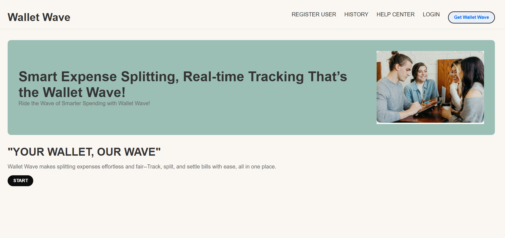
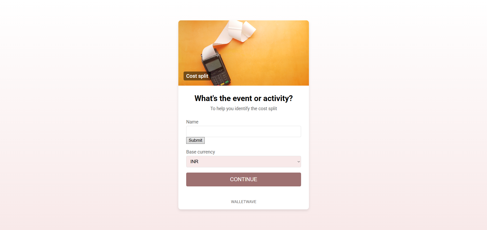
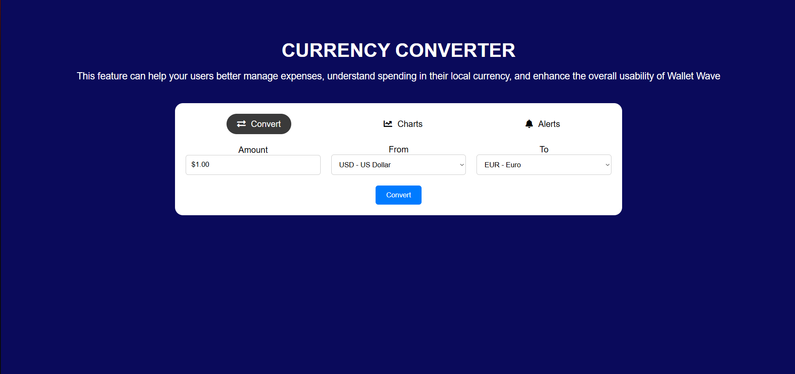
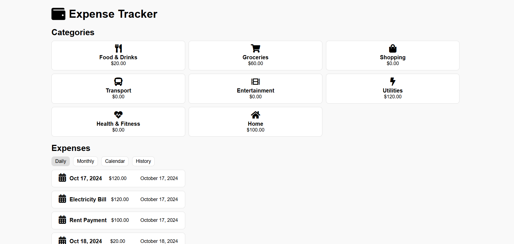
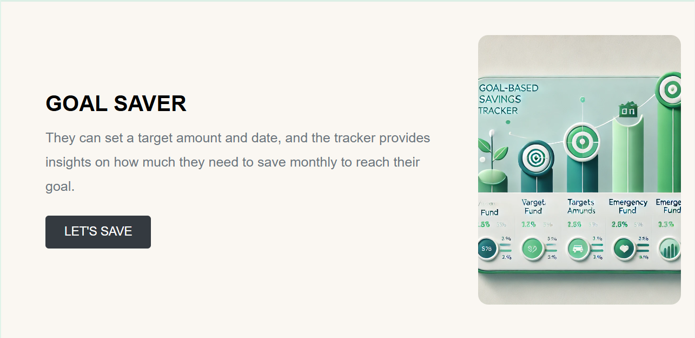

# 💸 WalletWave: Smart Expense Management Platform

WalletWave is a Flask-based personal finance web application designed to simplify group expense management and everyday financial planning.

The platform provides users with multiple financial tools including bill splitting, expense tracking, currency conversion, and goal-based savings planning through a clean and intuitive web interface.

---

## 🌟 Features

### 🧾 Bill Splitting

Split shared expenses fairly among friends, roommates, or groups.

- Calculate individual contributions instantly
- Ensure transparent expense sharing
- Reduce confusion and settlement disputes

---

### 💱 Currency Converter

Convert currencies using real-time exchange rates.

- Supports multiple international currencies
- Accurate conversions
- Useful for travelers and international transactions

---

### 📊 Expense Tracker

Track and monitor monthly spending patterns.

Features include:

- Expense categorization
- Monthly spending overview
- Budget analysis
- Financial habit monitoring

---

### 🎯 Goal Saver

Plan and achieve savings goals efficiently.

Users can:

- Set savings targets
- Define target dates
- Calculate required monthly savings
- Track progress toward financial goals

---

## 🏗️ System Architecture

```text
User Input
     |
     ↓
Flask Backend
     |
     ├── Bill Splitting Module
     ├── Expense Tracker Module
     ├── Currency Converter Module
     └── Goal Saver Module
     |
     ↓
Financial Calculations
     |
     ↓
Result Visualization
```

---

## 📂 Project Structure

```text
WalletWave/
│
├── static/                    # CSS, JavaScript, Images
│
├── templates/                # HTML templates
│   ├── index.html
│   ├── expenses.html
│   ├── splitter.html
│   ├── convert.html
│   └── ...
│
├── WalletWave.py             # Main Flask application
├── requirements.txt
├── README.md
├── LICENSE
└── .gitignore
```

---

## 🛠️ Technologies Used

### Backend

- Python
- Flask

### Frontend

- HTML5
- CSS3
- JavaScript

### Libraries

- Flask
- Requests
- Currency APIs

---

## 📸 Screenshots

### 🏠 Home Page



### 🧾 Bill Splitting Feature



### 💱 Currency Converter



### 📊 Expense Tracker



### 🎯 Goal Saver



---

## 🚀 Installation

### Clone Repository

```bash
git clone https://github.com/NejiHyuga55/WalletWave.git
```

### Navigate to Project

```bash
cd WalletWave
```

### Install Dependencies

```bash
pip install -r requirements.txt
```

### Run Application

```bash
python WalletWave.py
```

The application will start on:

```text
http://127.0.0.1:5000/
```

---

## 🎮 Application Modules

### 🧾 Bill Splitter

Calculates individual shares of shared expenses among multiple users.

### 💱 Currency Converter

Converts currencies using current exchange rates.

### 📊 Expense Tracker

Tracks and categorizes expenses for better budgeting.

### 🎯 Goal Saver

Helps users estimate monthly savings required to achieve financial goals.

---

## 🔮 Future Improvements

- User Authentication
- Database Integration
- Expense History Storage
- Data Visualization Dashboards
- Mobile Responsive Design Improvements
- Recurring Expense Tracking
- Email Notifications
- AI-Based Spending Insights

---

## 👥 Team

Developed by:

- Hriday Thakur
- Kanishka Jain
- Dhanishka Agrawal
- Sahiba Afreen
- Laksh Joshi

---

## 📄 License

This project is licensed under the MIT License.
